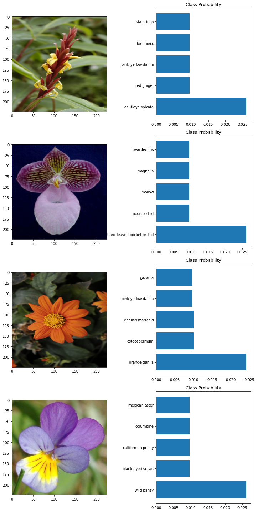

# Image Classifier

## Summary

This project trains an image classifier to recognize different species of flowers. Imagine using something like this in a phone app that tells you the name of the flower your camera is looking at. This project will train this classifier, then export it for use in an application. This project uses [this dataset](http://www.robots.ox.ac.uk/~vgg/data/flowers/102/index.html) from Oxford of 102 flower categories. Below are a few examples. 


The project is broken down into multiple steps:

* Load the image dataset and create a pipeline.
* Build and Train an image classifier on this dataset.
* Use the trained model to perform inference on flower images.

After completing the [notebook](Image_Classifier_Project.ipynb), this project creates an [application](predict.py) that can be trained on any set of labeled images. Here the network will be learning about flowers and end up as a command line application. This can be implemented for other applications-- imagine an app where you take a picture of a car, it tells you what the make and model is, then looks up information about it.


## Setup

### Dependencies

This script requires imports of the following:

```python
import pandas as pd
import numpy as np
import matplotlib.pyplot as plt
import json
import time
from PIL import Image
```

Tensorflow imports:

```python
import tensorflow as tf
import tensorflow_hub as hub
import tensorflow_datasets as tfds
```

The script requires the updated version of TensorFlow and a GPU enabled workspace:

```python
print('Using:')
print('\t\u2022 TensorFlow version:', tf.__version__)
print('\t\u2022 tf.keras version:', tf.keras.__version__)
print('\t\u2022 Running on GPU' if tf.test.is_gpu_available() else '\t\u2022 GPU device not found. Running on CPU')
```

Additional imports for `predict.py`:

```python
import argparse
```


## Steps

1. ### Load the Dataset

   - Use `tensorflow_datasets` to load the [Oxford Flowers 102 dataset](https://www.tensorflow.org/datasets/catalog/oxford_flowers102).

   -  This dataset has 3 splits: `'train'`, `'test'`, and `'validation'`.

   -  Ensure that the training data is normalized and resized to 224x224 pixels as required by the pre-trained networks.

   - The validation and testing sets are used to measure the model's performance on data it hasn't seen yet, but the data still needs to be normalized and the images need to be resized to the appropriate size.

   - Code:

     ```python
     dataset, dataset_info = tfds.load('oxford_flowers102', as_supervised = True, with_info = True)
     ```


2. ### Explore the Dataset

   

   - Explore the number of images in each the test, training, and validation sets, the number of classes in the dataset, and the shape of the images in the dataset

     ```
     There are 6,149 images in the test set
     There are 1,020 images in the training set
     There are 1,020 images in the validation set
     There are 102 classes in our dataset
     The images in our dataset have shape: (None, None, 3)
     ```

   - Explore the shape and corresponding label of 3 images in the training set:

     ```
     The images in the training set have:
     • label: 72 
     • shape: (500, 667, 3)
     The images in the training set have:
     • label: 84 
     • shape: (500, 666, 3)
     The images in the training set have:
     • label: 70 
     • shape: (670, 500, 3)
     ```

   - Map the label number to the category name using `label_map.json`

3. ### Create Pipeline

   - Normalize the training set, testing set, and validation set
   -  Resize the training, testing, and validation set to `224 x 224` pixels
   - Shuffle and batch the data with `batch_size = 32`

4. ### Build and Train the Classifier

   - Load the MobileNet pre-trained network from TensorFlow Hub.

     - Freeze this convolutional base model and use as a feature extractor
       - Freezing (by setting `layer.trainable = False`) prevents the weights in a given layer from being updated during training. MobileNet V2 has many layers, so setting the entire model's trainable flag to False will freeze all the layers

   - Define a new, untrained feed-forward network as a classifier.

     - Create a tf.keras Sequential model with the following layers:
       - `feature_extractor` 
       - Dense layer with 256, 128, and 64 neurons and a `relu` activation function
       - Dense layer with 102 neurons since the dataset has 102 different types of classes. You get the predictions of the model from this layer.
       - Dropout layers with the dropout rate = 0.2 after each Dense layer. This prevents overfitting and produced the best results.

   - Train the classifier.

     - ```python
       model.compile(optimizer=tf.keras.optimizers.Adam(),
                     loss='sparse_categorical_crossentropy',
                     metrics=['acc'])
       ```

   - Fit the model

     - Use `30 Epochs` as it gives the best accuracy

     - Use  `validation_batches` as the validation data

     - ```python
       history = model.fit(training_batches,
                           epochs=EPOCHS,
                           validation_data=validation_batches)
       ```

   - Plot the loss and accuracy values achieved during training the the training and validation set.

     

   - Test the network-- Print the loss and accuracy values achieved on the entire test set

     ```
     Loss on the TEST Set: 1.300
     Accuracy on the TEST Set: 71.264%
     ```

   - Save the [trained model](1587680462.h5) as a Keras model. 

5. ### Inference for Classification

   - Create the `predict` function that takes an image and a model, and then returns the top `𝐾` most likely class labels along with the probabilities

     - Example:

       ```python
       image = './test_images/hard-leaved_pocket_orchid.jpg'
       model = tf.keras.models.load_model('1587680462.h5', custom_objects={'KerasLayer':hub.KerasLayer})
       k = 5
       
       probs, classes = predict(image_path, reloaded_keras_model, 5)
       print(probs)
       print(classes)
       > [0.02620647 0.00964183 0.00964173 0.00964158 0.00964155]
       > ['1', '6', '96', '86', '67']
       ```

   - Plot the images in [test_images](test_images) alongside a bar chart of the top 5 most likely class labels and their corresponding probabilities

     

6. Create the application [predict.py](predict.py)

   - The user inputs an `image_path` and a `model_name`, and the application returns the most likely class of that image along with the probability of that class

   - Usage:

     - ```
       python predict.py image_path model_name
       ```

     - Optional arguments:

       - `--top_k`  :   returns the top `K` most likely classes (numerical class values and class names) and their corresponding probabilities. Default `1`
       - `--category_names` : returns the class names corresponding to the top k most likely class numbers. Default `label_map.json`
       - 

   - **Examples**:

   - Show the help message

     ```
     python predict.py test_images/orange_dahlia.jpg 1587680462.h5 -h
     ```

     Output:

     ```
     usage: predict.py [-h] [--top_k TOP_K] [--category_names JSON_FILE]
                       img_path my_model
     
     Predict image label.
     
     positional arguments:
       img_path              the path to the image
       my_model              the path to the model
     
     optional arguments:
       -h, --help            show this help message and exit
       --top_k TOP_K         Return the top K most likely classes
       --category_names JSON_FILE
                             Path to a JSON file mapping labels to flower names`
     ```

   - Get the most likely class and probability for `orange_dahlia.jpg`

     ```
     python predict.py test_images/orange_dahlia.jpg 1587680462.h5
     ```

     Output:

     ```
     Proabilities: [0.02419206]
     Label Numbers: ['58']
     Label Names: ['orange dahlia']
     ```

   - Get the 5 most likely classes and probabilities for `orange_dahlia.jpg`

     ```
     python predict.py test_images/orange_dahlia.jpg 1587680462.h5 --top_k 5
     ```

     Output:

     ```
     Proabilities: [0.02419206 0.00999861 0.00997459 0.00968572 0.00968072]
     Label Numbers: ['58', '65', '4', '59', '70']
     Label Names: ['orange dahlia', 'osteospermum', 'english marigold', 'pink-yellow dahlia', 'gazania']
     ```

   - Get the most likely class and probability for `orange_dahlia.jpg` using the class names in `label_map.json`

     ```
     python predict.py test_images/orange_dahlia.jpg 1587680462.h5 --category_names label_map.json
     ```

     Output:

     ```
     Proabilities: [0.02419206]
     Label Numbers: ['58']
     Label Names: ['orange dahlia']
     ```

   - Get the top 6 likely classes and probabilities for `orange_dahlia.jpg` using the class names in `label_map.json`

     ```
     python predict.py test_images/orange_dahlia.jpg 1587680462.h5 --top_k 6 --category_names label_map.json
     ```

     Ouput:

     ```
     Proabilities: [0.02419206 0.00999861 0.00997459 0.00968572 0.00968072 0.00967942]
     Label Numbers: ['58', '65', '4', '59', '70', '99']
     Label Names: ['orange dahlia', 'osteospermum', 'english marigold', 'pink-yellow dahlia', 'gazania', 'blanket flower']
     ```